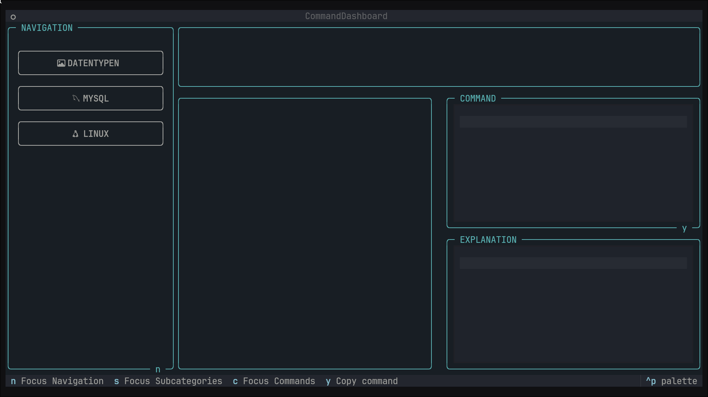
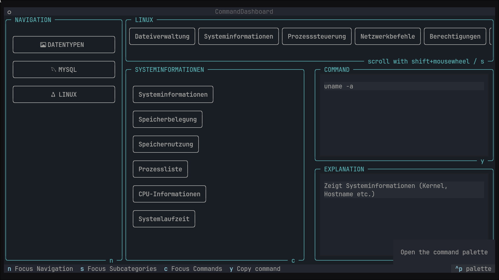

# 🧠 Command Dashboard

A terminal-based command reference tool built with [Textual](https://textual.textualize.io/). 
This dashboard provides categorized command snippets for various technologies, aiming to be a quick-access 
resource for developers.




---

## 🚀 Features

- **Categorized Commands**: Organized by technology (e.g., Linux, Python, SQL).
- **Modular Structure**: Each category is a separate module for scalability.
- **Nerd Font Icons**: Visual enhancements using [Nerd Fonts](https://www.nerdfonts.com/).
- **Clipboard Integration**: Easily copy commands to your clipboard.
- **Keyboard Navigation**: Navigate through categories and commands using keys.

---

## 🛠 Installation

### Prerequisites

- Python 3.8+
- [Poetry](https://python-poetry.org/)
- A terminal that supports Nerd Fonts (e.g., [Kitty](https://sw.kovidgoyal.net/kitty/))

### Steps

1. **Clone the Repository**

   ```bash
   git clone https://github.com/dcazrael/command-dashboard.git
   cd command-dashboard
   ```

2. **Install Dependencies**

   ```bash
   poetry install
   ```

3. **Run the Application**

   ```bash
   poetry run python -m command_dashboard
   ```

---

## 🎨 Nerd Font Setup

To display icons correctly:

1. **Download a Nerd Font**: [Nerd Fonts Downloads](https://www.nerdfonts.com/font-downloads)
2. **Install the Font**:
   - **Linux**: Place the font in `~/.local/share/fonts` and run `fc-cache -fv`.
   - **Windows**: Right-click the font file and select "Install".
3. **Configure Terminal**: Set your terminal's font to the installed Nerd Font.

---

## 📁 Project Structure

```plaintext
command-dashboard/
├── assets/                 # Assets like fonts and images
├── command_dashboard/      # Main application code
│   ├── commands/           # Command modules per category
│   ├── utils/              # Utility functions
│   ├── views/              # UI components
│   └── widgets/            # Custom widgets
├── tests/                  # Test cases
├── poetry.lock             # Poetry lock file
├── pyproject.toml          # Project metadata
└── README.md               # This file
```

---

## 🧩 Adding New Command Categories

1. **Create a New Module**: Add a new `.py` file in `command_dashboard/commands/` (e.g., `docker.py`).
2. **Define Commands**: Structure your commands as a nested dictionary:

   ```python
   commands = {
       "Category Name": {
           "Command Name": {
               "command": "actual command",
               "explanation": "description"
           },
           ...
       },
       ...
   }
   ```

3. **Avoid Loading Drafts**: Prefix draft modules with `_` or `__` to exclude them from loading.

---

## 📋 Keyboard Shortcuts

- **Navigate Categories**: Use arrow keys or assigned shortcuts.
- **Select Command**: Press `Enter` to view command details.
- **Copy Command**: Press `c` to copy the command to the clipboard.

---

## 📌 Roadmap

- [ ] Implement search functionality.
- [ ] Add support for user-defined commands.
- [ ] Enhance UI with more customization options.

---

## 🤝 Contributing

Contributions are welcome! Please open issues or submit pull requests for enhancements or bug fixes.

---

## 📄 License

This project is licensed under the MIT License.
